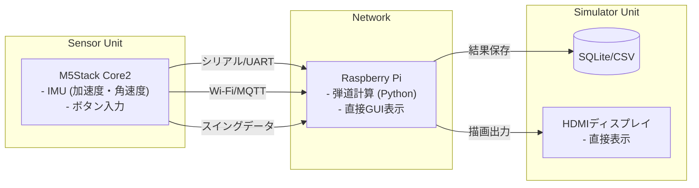
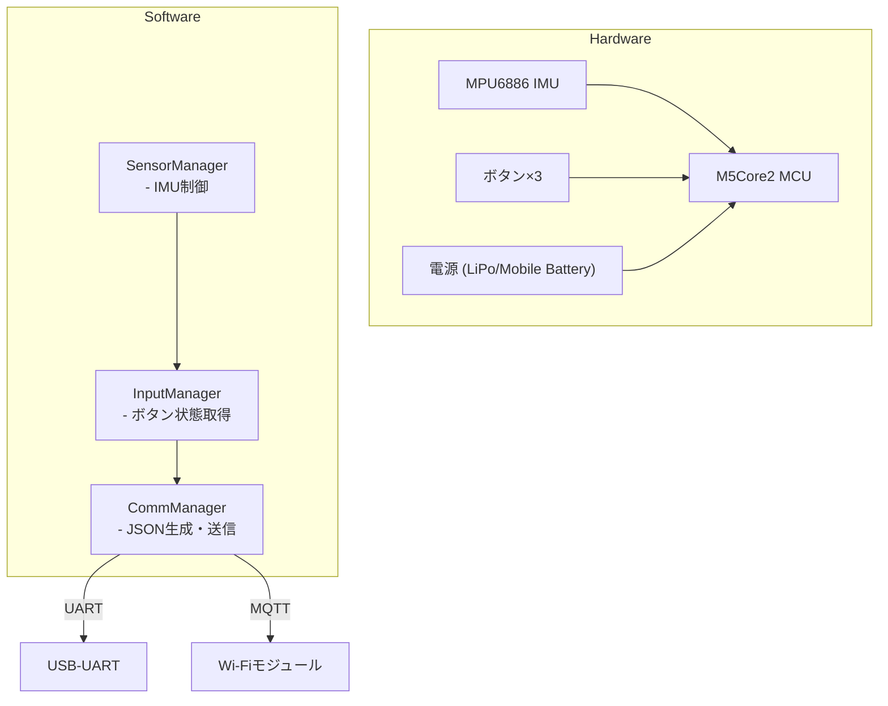
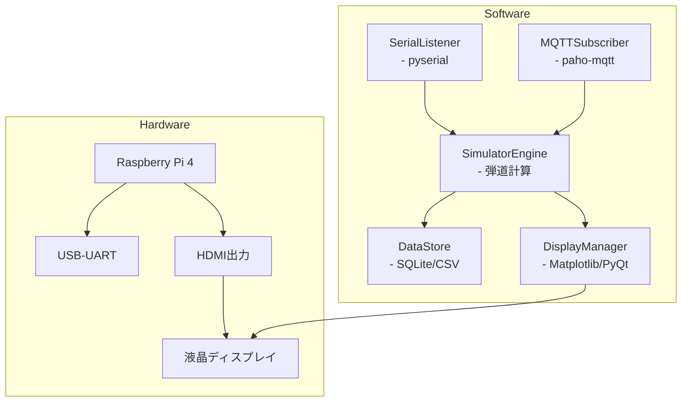
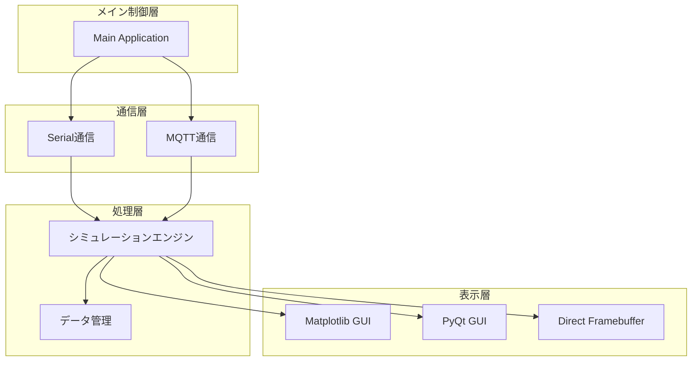

# ゴルフHILSシステム設計書

## 1. システム全体概要

### 1.1 システムの目的
M5Stackをセンサーユニットとして使用し、ゴルフスイングデータを取得。Raspberry Pi上で弾道シミュレーションを実行し、結果をラズパイ直結ディスプレイで直接表示するHILS（Hardware-in-the-Loop Simulation）システム。

### 1.2 主要特徴
- **リアルタイム性**: センサーデータの即座な処理と結果表示
- **スタンドアロン動作**: ネットワーク接続不要での完結した動作
- **直接表示**: ラズパイのHDMI/液晶ディスプレイによる即時結果確認
- **ポータブル設計**: モバイルバッテリ駆動による現場での使用可能

### 1.3 技術スタック概要
- **センサ側**: C/C++（Arduino環境）
- **処理側**: Python（シミュレーション・GUI）
- **通信**: UART（USB シリアル）または MQTT over Wi‑Fi
- **表示**: Matplotlib、PyQt、直接フレームバッファ

---

## 2. システム全体アーキテクチャ図



---

## 3. 機能別アーキテクチャ

### 3.1 センサーユニット（M5Stack）

#### 3.1.1 ハードウェア構成
- M5Stack Core2
  - MPU6886 (IMU)：加速度・角速度センサー
  - ボタン×3：クラブ種別・プレイヤー選択
  - Wi-Fi モジュール：MQTT通信用
  - USB-UART：シリアル通信用
- 電源: モバイルバッテリ または LiPo バッテリ

#### 3.1.2 ソフトウェア構成
- **開発環境**: Arduino Core for M5Stack (C/C++)
- **通信ライブラリ**: HardwareSerial、WiFi.h + PubSubClient
- **プロジェクト構成**:
  - `/src/SensorManager`: IMU制御・データ取得
  - `/src/InputManager`: ボタン処理・設定管理
  - `/src/CommManager`: JSON生成・送信制御



#### 3.1.3 データプロトコル例（JSON over UART）
```cpp
// センサ側送信サンプル（C++）
struct SwingData {
    float accel_x, accel_y, accel_z;
    float gyro_x, gyro_y, gyro_z;
    uint8_t club_type;    // 0=Driver,1=Iron…
};

void sendSwing(const SwingData& d) {
    StaticJsonDocument<128> doc;
    doc["ax"] = d.accel_x;
    doc["ay"] = d.accel_y;
    doc["az"] = d.accel_z;
    doc["gx"] = d.gyro_x;
    doc["gy"] = d.gyro_y;
    doc["gz"] = d.gyro_z;
    doc["club"] = d.club_type;
    serializeJson(doc, Serial);
    Serial.println();
}
```

### 3.2 シミュレーションユニット（Raspberry Pi）

#### 3.2.1 ハードウェア構成
- Raspberry Pi 4
  - USB-UART：センサーとの通信
  - ネットワーク (有線/Wi‑Fi)：MQTT通信用
  - HDMI出力：直接ディスプレイ接続
- ストレージ: SDカード（データ保存用）
- ディスプレイ: HDMI直結液晶またはモニタ

#### 3.2.2 主要機能
- データ受信（シリアル or MQTT）
- 弾道シミュレーション（速度・角度・スピンモデル）
- データ保存（SQLite / CSV）
- 直接GUI表示：
  - **Matplotlib**: リアルタイムグラフ表示
  - **PyQt/Tkinter**: インタラクティブGUI
  - **フレームバッファ**: 高速描画

#### 3.2.3 ソフトウェア構成


#### 3.2.4 受信インターフェース例
```python
# Python + pyserial 受信サンプル
import serial, json
import matplotlib.pyplot as plt

ser = serial.Serial('/dev/ttyUSB0', 115200, timeout=1)
fig, ax = plt.subplots()
plt.ion()  # インタラクティブモード

while True:
    line = ser.readline().decode().strip()
    if not line: continue
    data = json.loads(line)
    # リアルタイム表示更新
    ax.clear()
    ax.plot(trajectory_x, trajectory_y)
    plt.draw()
    plt.pause(0.01)
```

---

## 4. 詳細技術・設計

### 4.1 ハードウェア構成

#### 4.1.1 センサーユニット詳細
| 項目 | 仕様 | 用途 |
|------|------|------|
| MCU | ESP32-D0WDQ6 | メイン制御 |
| IMU | MPU6886 | 加速度・角速度検出 |
| ディスプレイ | 2.0" IPS LCD | 状態表示 |
| ボタン | 物理ボタン×3 | 設定・操作 |
| 通信 | USB-C, Wi-Fi | データ送信 |
| 電源 | 内蔵LiPo 390mAh | モバイル動作 |

#### 4.1.2 シミュレーションユニット詳細
| 項目 | 仕様 | 用途 |
|------|------|------|
| SBC | Raspberry Pi 4 (4GB) | メイン処理 |
| ストレージ | microSD 32GB+ | OS・データ保存 |
| 表示出力 | HDMI 1.4 | 直接ディスプレイ接続 |
| USB | USB 3.0×2, USB 2.0×2 | センサー接続 |
| ネットワーク | 有線LAN, Wi-Fi | MQTT通信 |
| 電源 | USB-C 5V/3A | 安定動作保証 |

### 4.2 ソフトウェア構成

#### 4.2.1 センサーソフトウェア
```cpp
// メインアプリケーション構造
class GolfSensor {
private:
    SensorManager sensor;
    InputManager input;
    CommManager comm;
    
public:
    void setup() {
        sensor.init();
        input.init();
        comm.init();
    }
    
    void loop() {
        if (input.isSwingDetected()) {
            SwingData data = sensor.captureSwing();
            comm.sendData(data);
        }
        delay(10);
    }
};
```

#### 4.2.2 シミュレーションソフトウェア構成
- **プロジェクト構成**:
  - `/comm/`: 通信制御（Serial/MQTT）
  - `/sim/`: 弾道計算エンジン
  - `/data/`: データ管理（SQLite/CSV）
  - `/display/`: 直接表示制御
  - `/config/`: 設定管理



#### 4.2.3 表示システム実装例
```python
# Matplotlib リアルタイム表示
import matplotlib.pyplot as plt
import matplotlib.animation as animation

class TrajectoryDisplay:
    def __init__(self):
        self.fig, self.ax = plt.subplots(figsize=(10, 8))
        self.ax.set_xlim(0, 300)
        self.ax.set_ylim(0, 100)
        
    def update_trajectory(self, trajectory_data):
        self.ax.clear()
        self.ax.plot(trajectory_data['x'], trajectory_data['y'])
        self.ax.set_title('ゴルフボール弾道シミュレーション')
        self.ax.set_xlabel('距離 (m)')
        self.ax.set_ylabel('高さ (m)')
        plt.draw()
        plt.pause(0.1)

# PyQt デスクトップアプリケーション
from PyQt5.QtWidgets import QApplication, QMainWindow

class GolfSimGUI(QMainWindow):
    def __init__(self):
        super().__init__()
        self.setWindowTitle('Golf HILS シミュレーター')
        self.setGeometry(100, 100, 1200, 800)
        
    def update_display(self, sim_results):
        # 直接GUIコンポーネント更新
        pass
```

---

## 5. 運用・管理

### 5.1 システム起動・運用手順

#### 5.1.1 初期セットアップ
1. **Raspberry Pi セットアップ**
   ```bash
   # 必要パッケージインストール
   sudo apt update && sudo apt install -y python3-pip python3-pyqt5
   pip3 install matplotlib pyserial paho-mqtt sqlite3
   
   # ディスプレイ設定（HDMI出力）
   sudo raspi-config  # Advanced Options -> Resolution設定
   ```

2. **M5Stack ファームウェア書き込み**
   ```bash
   # Arduino IDEまたはPlatformIO使用
   pio run --target upload
   ```

#### 5.1.2 日常運用
1. **システム起動**
   - Raspberry Pi 電源投入
   - M5Stack 電源投入・ペアリング確認
   - 表示アプリケーション自動起動

2. **測定・解析フロー**
   - M5Stack でクラブ種別選択
   - スイング実行
   - リアルタイム弾道表示確認
   - 結果データ自動保存

### 5.2 データ管理

#### 5.2.1 データ保存形式
```sql
-- SQLite スキーマ例
CREATE TABLE swing_data (
    id INTEGER PRIMARY KEY AUTOINCREMENT,
    timestamp DATETIME DEFAULT CURRENT_TIMESTAMP,
    club_type INTEGER,
    accel_x REAL, accel_y REAL, accel_z REAL,
    gyro_x REAL, gyro_y REAL, gyro_z REAL,
    calculated_speed REAL,
    calculated_angle REAL,
    distance REAL
);
```

#### 5.2.2 バックアップ・エクスポート
```python
# CSVエクスポート機能
import sqlite3, csv

def export_to_csv(db_path, csv_path):
    conn = sqlite3.connect(db_path)
    cursor = conn.execute("SELECT * FROM swing_data")
    
    with open(csv_path, 'w', newline='') as csvfile:
        csv_writer = csv.writer(csvfile)
        csv_writer.writerow([description[0] for description in cursor.description])
        csv_writer.writerows(cursor.fetchall())
```

### 5.3 メンテナンス

#### 5.3.1 キャリブレーション手順
```cpp
// M5Stack IMUキャリブレーション
void calibrateIMU() {
    float accel_offset[3] = {0, 0, 0};
    float gyro_offset[3] = {0, 0, 0};
    
    // 静止状態での100回サンプリング
    for (int i = 0; i < 100; i++) {
        // オフセット値計算・保存
    }
    
    // EEPROMに保存
    saveCalibrationData();
}
```

#### 5.3.2 システム診断
```python
# システムヘルスチェック
def system_health_check():
    checks = {
        'serial_connection': check_serial_port(),
        'display_output': check_display(),
        'storage_space': check_disk_space(),
        'sensor_response': ping_sensor()
    }
    return checks
```

### 5.4 GitHub プロジェクト管理

#### 5.4.1 リポジトリ構成
```
Golf_HILS_System/
├── sensor-firmware/          # M5Stack C/C++コード
│   ├── src/
│   ├── lib/
│   └── platformio.ini
├── simulator/                # Raspberry Pi Pythonコード
│   ├── comm/                 # 通信制御
│   ├── sim/                  # シミュレーション
│   ├── display/              # 表示制御
│   └── requirements.txt
├── docs/                     # 設計書・API仕様
└── scripts/                  # デプロイ・管理スクリプト
```

#### 5.4.2 CI/CD パイプライン
```yaml
# .github/workflows/main.yml
name: Golf HILS CI/CD
on: [push, pull_request]

jobs:
  sensor-test:
    runs-on: ubuntu-latest
    steps:
      - uses: actions/checkout@v2
      - name: PlatformIO Build
        run: |
          pip install platformio
          pio run -d sensor-firmware
          
  simulator-test:
    runs-on: ubuntu-latest
    steps:
      - uses: actions/checkout@v2
      - name: Python Test
        run: |
          cd simulator
          pip install -r requirements.txt
          python -m pytest tests/
```

---

## 6. その他

### 6.1 物理設計・機構
- **電源設計**: モバイルバッテリ給電 (10000mAh以上推奨)
- **筐体・固定具**: スイング時の振動対策、クラブ装着用マウント
- **防塵・防水**: IP54レベルの保護（屋外使用対応）
- **温度対応**: -10℃〜+50℃動作保証

### 6.2 拡張機能・将来計画
- **映像解析**: OpenCV によるフォーム撮影・解析
- **AI機能**: スイング改善アドバイス生成
- **複数センサー**: 複数箇所同期測定（クラブヘッド＋ボール）
- **クラウド連携**: データ蓄積・統計分析（オプション）

### 6.3 技術的制約・注意事項
- **測定精度**: IMU精度による弾道計算の限界
- **サンプリング周波数**: リアルタイム性と精度のトレードオフ
- **電池持続時間**: 連続使用可能時間の考慮
- **表示遅延**: 直接表示での描画性能最適化

### 6.4 参考資料・標準
- **通信プロトコル**: JSON over UART/MQTT仕様
- **データフォーマット**: IMUデータ・弾道パラメータ定義
- **キャリブレーション**: IMU校正手順・精度基準
- **API仕様**: 内部コンポーネント間インターフェース
