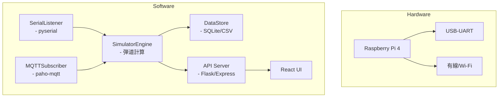

# ゴルフHILSシステム設計書

## 1. 概要
M5Stack をセンサーユニットとして使用し、スイングデータを取得。  
Raspberry Pi（または同等の SBC）上で弾道シミュレータを動作させ、結果を可視化・フィードバックするシステム。

- **センサ側言語**：C / C++（Arduino ライクな環境）  
- **処理側言語**：Python または TypeScript（Node.js）、受取側 IF は C++ も可  
- **通信方式**：UART（USB シリアル）または MQTT over Wi-Fi  
- **バージョン管理**：GitHub でモノリポ or サブモジュール構成を検討  

---

## 2. 全体アーキテクチャ図

```mermaid
graph LR
  subgraph Sensor Unit
    MS[M5Stack Core2<br/>- IMU (加速度・角速度)<br/>- ボタン入力]
  end

  subgraph Network
    MS -- シリアル/UART --> RPI
    MS -- Wi-Fi/MQTT --> RPI
  end

  subgraph Simulator Unit
    RPI[Raspberry Pi<br/>- 弾道計算 (Python/TS)<br/>- GUI (Flask/React)]
    DB[(SQLite/CSV)]
    UI[Web UI<br/>- ブラウザ表示]
  end

  MS -->|スイングデータ| RPI
  RPI -->|結果保存| DB
  RPI -->|WebSocket/REST| UI
```

---

## 3. 個別 IoT機器アーキテクチャ

### 3.1 センサユニット (M5Stack Core2)

```mermaid
flowchart TD
  subgraph Hardware
    IMU[MPU6886 IMU]
    BTN[ボタン×3]
    MCU[M5Core2 MCU]
    PWR[電源 (LiPo/Mobile Battery)]
    IMU --> MCU
    BTN --> MCU
    PWR --> MCU
  end
  subgraph Software
    SensorMgr[SensorManager<br/>- IMU制御]
    InputMgr[InputManager<br/>- ボタン状態取得]
    CommMgr[CommManager<br/>- JSON生成・送信]
    SensorMgr --> InputMgr --> CommMgr
  end
  CommMgr -->|UART| UART[USB-UART]
  CommMgr -->|MQTT| WIFI[Wi-Fiモジュール]
```

### 3.2 処理ユニット (Raspberry Pi)



---

## 4. その他必要事項
- 電源設計：モバイルバッテリ給電 or PoE  
- 筐体・固定具：スイング時の振動対策、マウント方法  
- キャリブレーション：IMU のオフセット調整手順  
- 延長機能：OpenCV によるフォーム撮影・解析  

---

## 5. GitHub プロジェクト管理

### 5.1 リポジトリ構成案
**A) モノリポジトリ**  
```
/sensor-firmware   ← M5Stack (C/C++)
/simulator-py      ← Python シミュレータ
/simulator-web     ← TypeScript Web UI
/docs              ← 設計書・API仕様
```

**B) マルチリポジトリ**（サブモジュール or Actions 連携）  
- sensor-firmware  
- simulator-core  
- simulator-ui  
- infrastructure (CI/CD, Dockerfile)  

### 5.2 ブランチ戦略
- `main`：リリース用  
- `develop`：結合テスト用  
- `feature/xxx`：機能別  
- `hotfix/xxx`：障害対応  

### 5.3 CI/CD
- **GitHub Actions**：  
  - センサ側 → ビルド & ユニットテスト  
  - 処理側 → Lint（flake8 or ESLint） & ユニットテスト  
- **リリース**：GitHub Releases + Docker イメージ公開  
