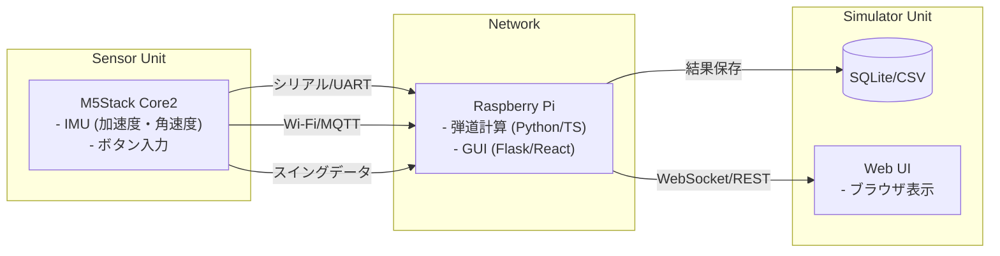
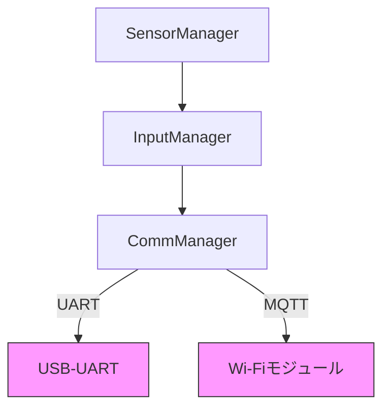
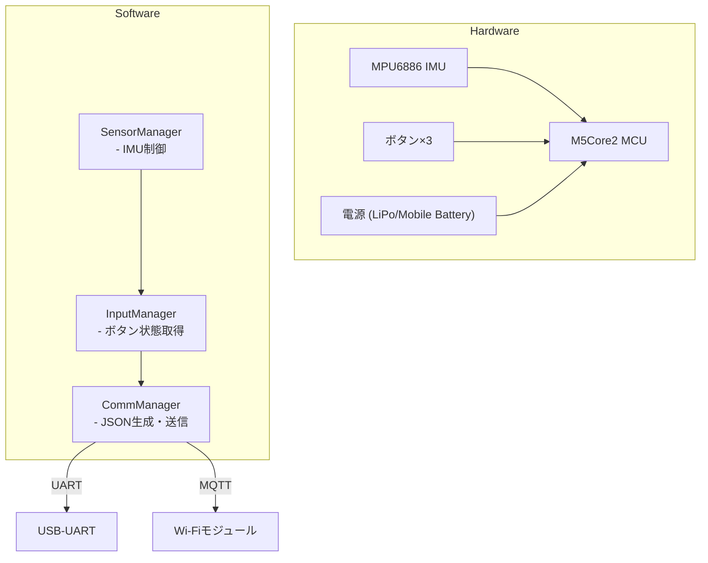
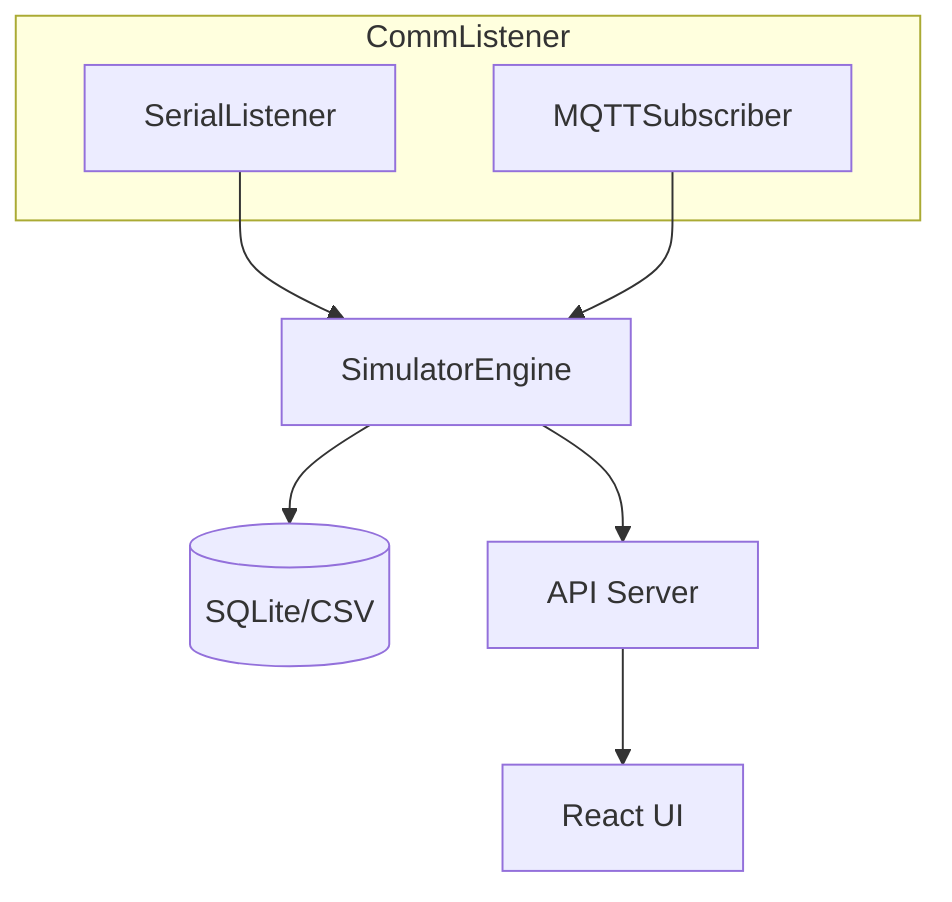
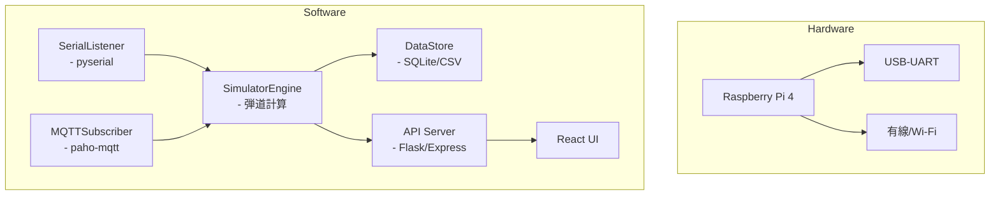

# ゴルフHILSシステム設計書

## 1. 概要
M5Stack をセンサーユニットとして使用し、スイングデータを取得。
Raspberry Pi（または同等の SBC）上で弾道シミュレータを動作させ、結果を可視化・フィードバックするシステム。

- **センサ側言語**：C / C++（Arduino ライクな環境）  
- **処理側言語**：Python または TypeScript（Node.js）、受取側 IF は C++ も可  
- **通信方式**：UART（USB シリアル）または MQTT over Wi‑Fi  
- **バージョン管理**：GitHub でモノリポ or サブモジュール構成を検討

---

## 2. 全体アーキテクチャ図



---

## 3. センサ側（M5Stack）

### 3.1 機能
- IMU（MPU6886 等）からの加速度・角速度取得  
- クラブ種別・プレイヤー名選択用ボタン入力  
- データ整形・パケット化  
- シリアル or MQTT 経由で送信  

### 3.2 開発言語・環境
- **言語**：C / C++  
- **フレームワーク**：Arduino Core for M5Stack  
- **通信ライブラリ**：  
  - シリアル：`HardwareSerial`  
  - MQTT：`WiFi.h` + `PubSubClient`  

### 3.3 プロトコル例（JSON over UART）
```cpp
// センサ側送信サンプル（C++）
struct SwingData {
    float accel_x, accel_y, accel_z;
    float gyro_x, gyro_y, gyro_z;
    uint8_t club_type;    // 0=Driver,1=Iron…
};

void sendSwing(const SwingData& d) {
    StaticJsonDocument<128> doc;
    doc["ax"] = d.accel_x;
    doc["ay"] = d.accel_y;
    doc["az"] = d.accel_z;
    doc["gx"] = d.gyro_x;
    doc["gy"] = d.gyro_y;
    doc["gz"] = d.gyro_z;
    doc["club"] = d.club_type;
    serializeJson(doc, Serial);
    Serial.println();
}
```

---

## 4. 処理側（Raspberry Pi）

### 4.1 機能
- データ受信（シリアル or MQTT）  
- 弾道シミュレーション（速度・角度・スピンモデル）  
- データ保存（SQLite / CSV）  
- 可視化：  
  - **CLI**：Matplotlib（Python）  
  - **Web**：Flask + React（TypeScript）  

### 4.2 受信インターフェース例
```python
# Python + pyserial 受信サンプル
import serial, json

ser = serial.Serial('/dev/ttyUSB0', 115200, timeout=1)
while True:
    line = ser.readline().decode().strip()
    if not line: continue
    data = json.loads(line)
    # data['ax'], data['gy'], data['club'] などを処理
```

```ts
// Node.js + mqtt.js 受信サンプル
import mqtt from 'mqtt';
const client = mqtt.connect('mqtt://broker.local');
client.subscribe('golf/swing');
client.on('message', (topic, msg) => {
  const data = JSON.parse(msg.toString());
  // data.ax, data.gy, data.club などを処理
});
```

---

## 5. アーキテクチャ設計

### 5.1 送信側アーキテクチャ

#### ハードウェア構成
- M5Stack Core2  
  - MPU6886 (IMU)  
  - ボタン×3  
  - Wi-Fi モジュール  
  - USB-UART インターフェース  
- 電源: モバイルバッテリ or LiPo

#### ソフトウェア構成
- **プロジェクト構成**  
  - `/src/SensorManager`：IMU 制御  
  - `/src/InputManager`：ボタン処理  
  - `/src/CommManager`：JSON 生成・送信（UART/MQTT）  



#### 詳細アーキ　センサユニット (M5Stack Core2)


---

### 5.2 受信側アーキテクチャ

#### ハードウェア構成
- Raspberry Pi 4  
  - USB-UART  
  - ネットワーク (有線/Wi‑Fi)  
- ストレージ: SDカード (データ保存用)  
- ディスプレイ: HDMI or Web UI

#### ソフトウェア構成
- **プロジェクト構成**  
  - `/comm/CommListener`：シリアル/MQTT 受信  
  - `/sim/SimulatorEngine`：弾道計算ロジック  
  - `/data/DataStore`：SQLite/CSV 保存  
  - `/api/APIServer`：Flask/Express  
  - `/ui/WebUI`：React (TypeScript)  


#### 詳細アーキ 処理ユニット (Raspberry Pi)


---

## 6. その他必要事項
- 電源設計：モバイルバッテリ給電 or PoE  
- 筐体・固定具：スイング時の振動対策、マウント方法  
- キャリブレーション：IMU のオフセット調整手順  
- 延長機能：OpenCV によるフォーム撮影・解析  

---

## 7. GitHub プロジェクト管理

### 7.1 リポジトリ構成案
**A) モノリポジトリ**  
```
/sensor-firmware   ← M5Stack (C/C++)
/simulator-py      ← Python シミュレータ
/simulator-web     ← TypeScript Web UI
/docs              ← 設計書・API仕様
```

**B) マルチリポジトリ**（サブモジュール or Actions 連携）  
- sensor-firmware  
- simulator-core  
- simulator-ui  
- infrastructure (CI/CD, Dockerfile)  

### 7.2 ブランチ戦略
- `main`：リリース用  
- `develop`：結合テスト用  
- `feature/xxx`：機能別  
- `hotfix/xxx`：障害対応  

### 7.3 CI/CD
- **GitHub Actions**：  
  - センサ側 → ビルド & ユニットテスト  
  - 処理側 → Lint（flake8 or ESLint） & ユニットテスト  
- **リリース**：GitHub Releases + Docker イメージ公開  
