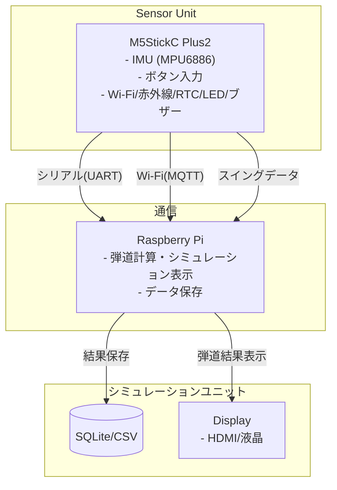
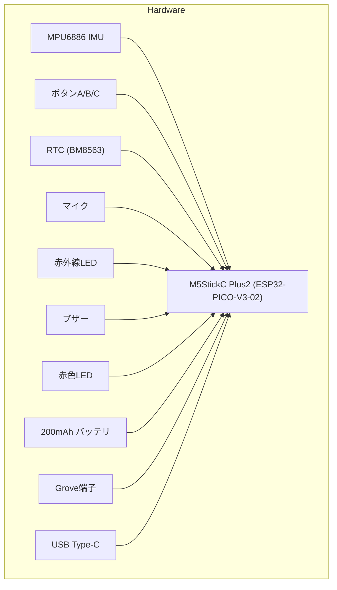
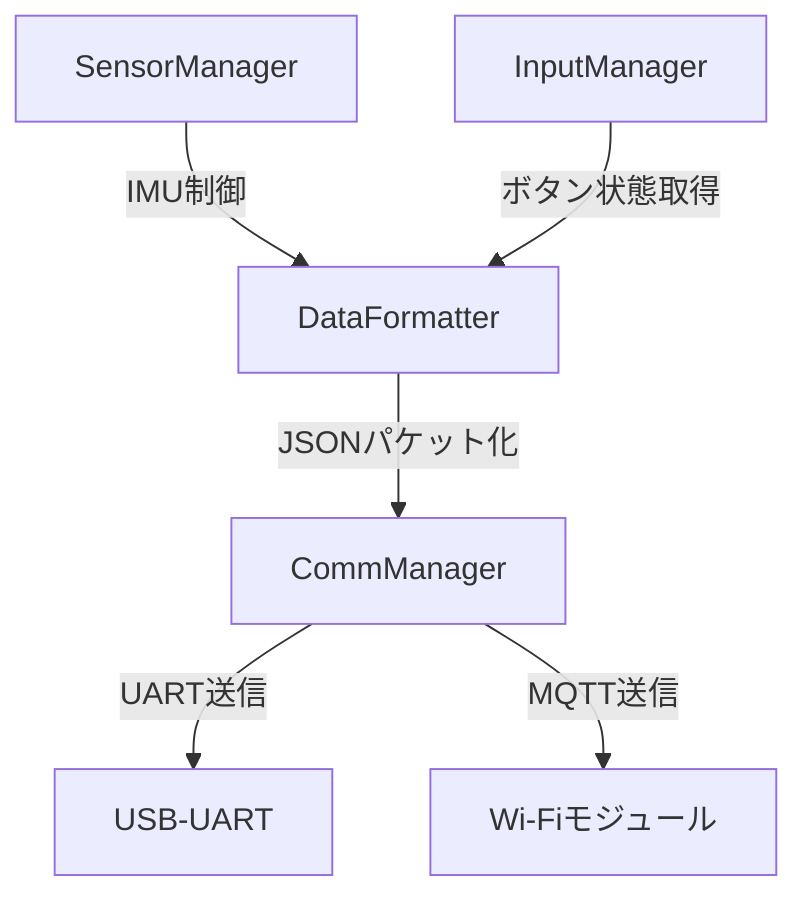
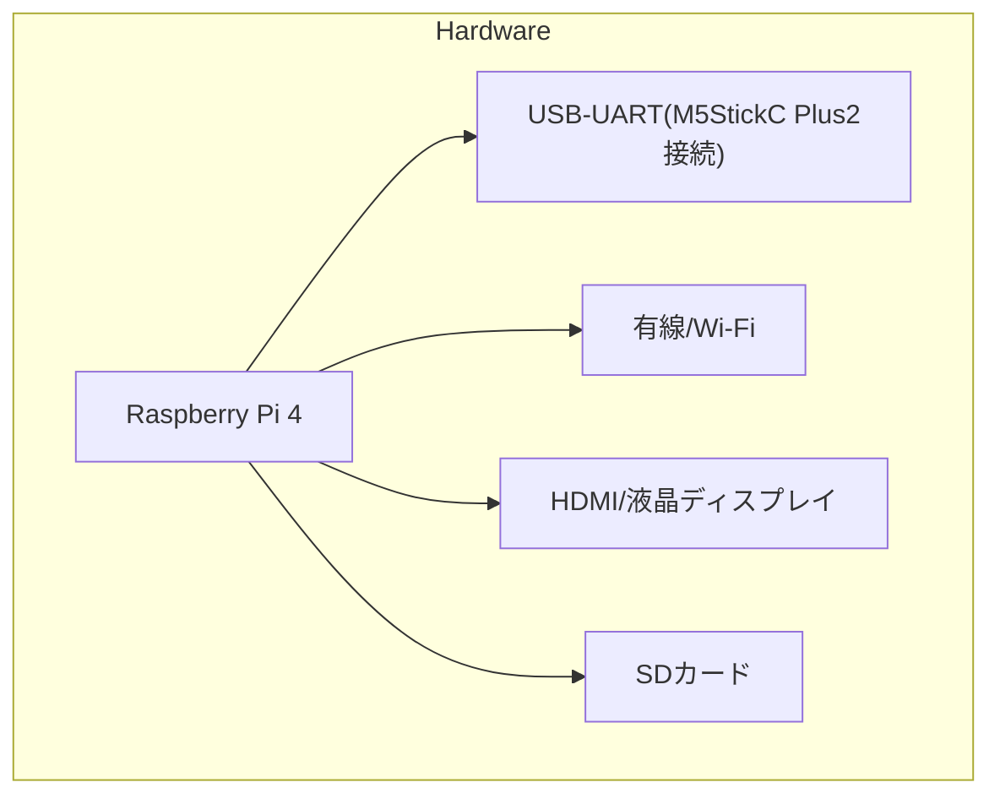
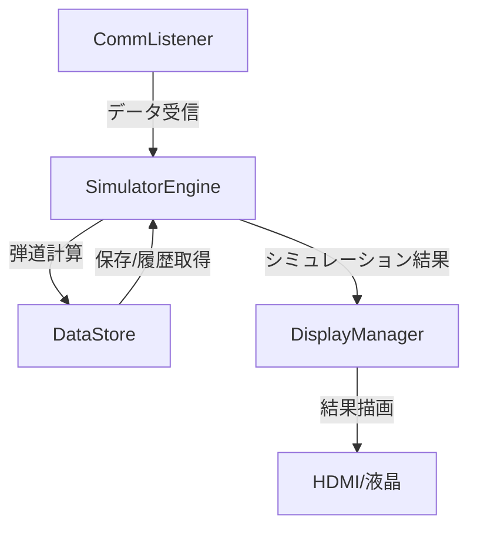

# ゴルフHILSシステム設計書

---

## 目次

1. システム全体概要
2. システム全体アーキテクチャ図
3. 機能別アーキテクチャ
   - 3.1 センサーユニット（M5StickC Plus2）
   - 3.2 シミュレーションユニット（Raspberry Pi）
4. 詳細技術・設計
   - 4.1 ハードウェア構成
   - 4.2 ソフトウェア構成
5. 運用・管理
6. その他

---

## 1. システム全体概要

本システムは、**M5StickC Plus2** をセンサーユニットとしてゴルフスイングデータを取得し、Raspberry Pi（以下ラズパイ）でデータ受信・弾道シミュレーション・結果保存・ディスプレイ表示を一括して行うHILS（Hardware-in-the-Loop Simulation）システムです。  
シミュレーション結果はラズパイ直結のディスプレイ（HDMIやタッチパネル液晶など）へ直接表示します。

- **センサーユニット（M5StickC Plus2）**：スイングデータ取得・送信
- **シミュレーションユニット（Raspberry Pi）**：受信、解析、弾道計算、データ保存、ディスプレイ表示

- **センサ側言語**：C / C++（Arduino ライクな環境）  
- **処理側言語**：Python または TypeScript（Node.js）、受取側 IF は C++ も可  
- **通信方式**：UART（USB シリアル）または MQTT over Wi‑Fi  
- **バージョン管理**：GitHub でモノリポ or サブモジュール構成を検討

---

## 2. システム全体アーキテクチャ図



---

## 3. 機能別アーキテクチャ

### 3.1 センサーユニット（M5StickC Plus2）

#### 【ハードウェア構成図】


#### 【ソフトウェア構成／主要モジュール】

- **SensorManager**: IMU制御・データ取得
- **InputManager**: ボタン入力監視・クラブ種別選択
- **DataFormatter**: センサ・入力データをJSONパケット化
- **CommManager**: UART/MQTT経由でデータ送信

#### 【M5StickC Plus2詳細仕様】
- SoC: ESP32-PICO-V3-02（デュアルコア 240MHz, 2MB PSRAM, 8MB Flash, Wi-Fi/Bluetooth 4.0）
- ディスプレイ: 1.14インチ 135x240 カラーTFT LCD（ST7789v2, 前機種より18.7%大型化）
- 内蔵センサ: 6軸IMU（MPU6886）、RTC（BM8563）、マイク（SPM1423）、赤外線LED、赤色LED、ブザー
- ボタン: 3つ（A/B/Cボタン, Cは2秒長押しで電源ON、6秒長押しで電源OFF。ソフト的に第三のボタンとして利用可）
- バッテリ: 200mAh（前機種比約1.7倍）
- 拡張: Grove互換ソケット（I2C, UART, GPIO）
- ポート: USB Type-C（給電・通信）
- 本体寸法・重量: 48x25x13mm, 17g

#### 【ピンアサイン・追加機能】
- GPIOの割当てや追加ピン（IR:G19、LED:G19、LCD:G27/15/14/13/12/5、HOLD:G4、ボタンC:G35、バッテリ電圧:G38等）
- 詳細: [M5Stack公式ドキュメント](https://docs.m5stack.com/ja/core/m5stickc_plus2)

#### 【電源操作方法】
- 電源ON: Cボタン2秒長押し or RTCウェイクアップ
- 電源OFF: Cボタン6秒長押し（USB未接続時）またはGPIO4制御

#### 【開発環境】
- Arduino Core for ESP32 / UIFlow / MicroPython / .NET nanoFramework など

#### 【活用例】
- IoT端末コントローラ / ウェアラブル / STEM教育 / DIY電子工作

#### 【主な機能】
- IMU（MPU6886）からの加速度・角速度取得
- クラブ種別・プレイヤー名選択用ボタン入力
- データ整形・パケット化（JSON）
- シリアル（UART, USB経由）またはMQTT over Wi-Fiで送信

#### 【送信データ例（C++/JSON over UART）】
```cpp
struct SwingData {
    float accel_x, accel_y, accel_z;
    float gyro_x, gyro_y, gyro_z;
    uint8_t club_type; // 0=Driver, 1=Iron, ...
};
void sendSwing(const SwingData& d) {
    StaticJsonDocument<128> doc;
    doc["ax"] = d.accel_x;
    doc["ay"] = d.accel_y;
    doc["az"] = d.accel_z;
    doc["gx"] = d.gyro_x;
    doc["gy"] = d.gyro_y;
    doc["gz"] = d.gyro_z;
    doc["club"] = d.club_type;
    serializeJson(doc, Serial);
    Serial.println();
}
```

---

### 3.2 シミュレーションユニット（Raspberry Pi）

#### 【ハードウェア構成図】


#### 【ソフトウェア構成／主要モジュール】

- **CommListener**: UART/MQTT経由でM5StickC Plus2からデータ受信
- **SimulatorEngine**: 受信データから弾道計算・シミュレーション
- **DataStore**: 計測データ・結果をSQLite/CSVに保存・履歴管理
- **DisplayManager**: シミュレーション結果や履歴をラズパイ直結ディスプレイに描画表示

#### 【主な機能】
- データ受信（UARTまたはMQTT）
- 弾道シミュレーション（飛距離・角度・スピン等の計算）
- 結果/履歴データの保存（SQLiteまたはCSV）
- シミュレーション結果のディスプレイ表示（HDMIやタッチ液晶/Pygame/Matplotlib等）

#### 【技術詳細】
- 言語: PythonまたはTypeScript（Node.js）
- データベース: SQLite/CSV
- 表示: Matplotlib（Python）、Pygame、Tkinter等によるグラフ・数値表示

#### 【データ受信サンプル（Python + pyserial）】
```python
import serial, json
ser = serial.Serial('/dev/ttyUSB0', 115200, timeout=1)
while True:
    line = ser.readline().decode().strip()
    if not line: continue
    data = json.loads(line)
    # data['ax'], data['gy'], data['club'] などを処理
```

#### 【データ受信サンプル（Node.js + mqtt.js）】
```ts
import mqtt from 'mqtt';
const client = mqtt.connect('mqtt://broker.local');
client.subscribe('golf/swing');
client.on('message', (topic, msg) => {
  const data = JSON.parse(msg.toString());
  // data.ax, data.gy, data.club などを処理
});
```

---

## 4. 詳細技術・設計

### 4.1 ハードウェア構成

#### センサーユニット（M5StickC Plus2）
- ESP32-PICO-V3-02
- MPU6886 (IMU)
- ボタン×3
- RTC/赤外線/LED/ブザー/マイク
- USB Type-C
- Grove互換ソケット
- バッテリ: 200mAh（長時間連続利用対応）

#### シミュレーションユニット（Raspberry Pi 4）
- USB-UART（M5StickC Plus2接続用）
- 有線/無線LAN
- HDMIまたはラズパイ用液晶ディスプレイ
- ストレージ: SDカード

### 4.2 ソフトウェア構成

#### センサーユニット側
- `/src/SensorManager`：IMU制御
- `/src/InputManager`：ボタン処理
- `/src/CommManager`：JSON生成・送信（UART/MQTT）

#### シミュレーションユニット側
- `/comm/CommListener`：シリアル/MQTT受信
- `/sim/SimulatorEngine`：弾道計算ロジック
- `/data/DataStore`：SQLite/CSV保存
- `/disp/DisplayManager`：シミュレーションと履歴結果の画面表示（Matplotlib, Pygame等）

---

## 5. 運用・管理

### リポジトリ構成案（モノリポ推奨）
```
/sensor-firmware   ← M5StickC Plus2用(C/C++)
/simulator-py      ← Pythonシミュレータ
/docs              ← 設計書・API仕様
```

### ブランチ戦略
- `main`：リリース用
- `develop`：結合テスト用
- `feature/xxx`：機能別
- `hotfix/xxx`：障害対応

### CI/CD
- **GitHub Actions**：
  - センサ側 → ビルド & ユニットテスト
  - 処理側 → Lint（flake8 or ESLint） & ユニットテスト
- **リリース**：GitHub Releases + Dockerイメージ公開

---

## 6. その他

- **電源設計**：M5StickC Plus2は200mAhバッテリ内蔵、長時間利用可能。モバイルバッテリやPoEなども利用可
- **筐体・固定具**：スイング時の振動対策、マウント方法（3Dプリント等推奨）
- **IMUキャリブレーション**：IMUのオフセット調整手順（起動時静止状態で自動キャリブレーションなど）
- **拡張案**：Groveソケット経由で外部センサ拡張、OpenCV等でフォーム撮影解析、音声出力によるフィードバックなど
- **初回セットアップの注意**：USB Type-Cケーブルは別売り。電源ON/OFF操作（Cボタンの長押し）を必ず確認
- **FAQ/トラブルシューティング**：電源が入らない場合はUSB接続やバッテリ残量、Cボタン長押し動作を確認
- **公式ドキュメント**：[M5StickC Plus2公式ページ](https://docs.m5stack.com/ja/core/m5stickc_plus2)

---

> ※ 本READMEの「M5Stack」は全て「M5StickC Plus2」を指します。

---

### 追加事項（既存READMEからの補足）

- **Web UI拡張**：将来的にWeb UI（React等）によるブラウザ表示やAPIサーバ（Flask/Express）経由での外部連携も可能です。
- **プロトコル例**：JSON over UART/MQTTでの通信を標準とし、他形式も拡張可能です。
- **バージョン管理**：モノリポジトリ/マルチリポジトリ両対応。サブモジュールやCI/CD連携も検討。
- **開発言語**：センサ側はC/C++（Arduino Core）、シミュレーション側はPython/TypeScript（Node.js）を推奨。
- **API仕様・設計書**：`/docs`ディレクトリに設計書・API仕様を格納。
