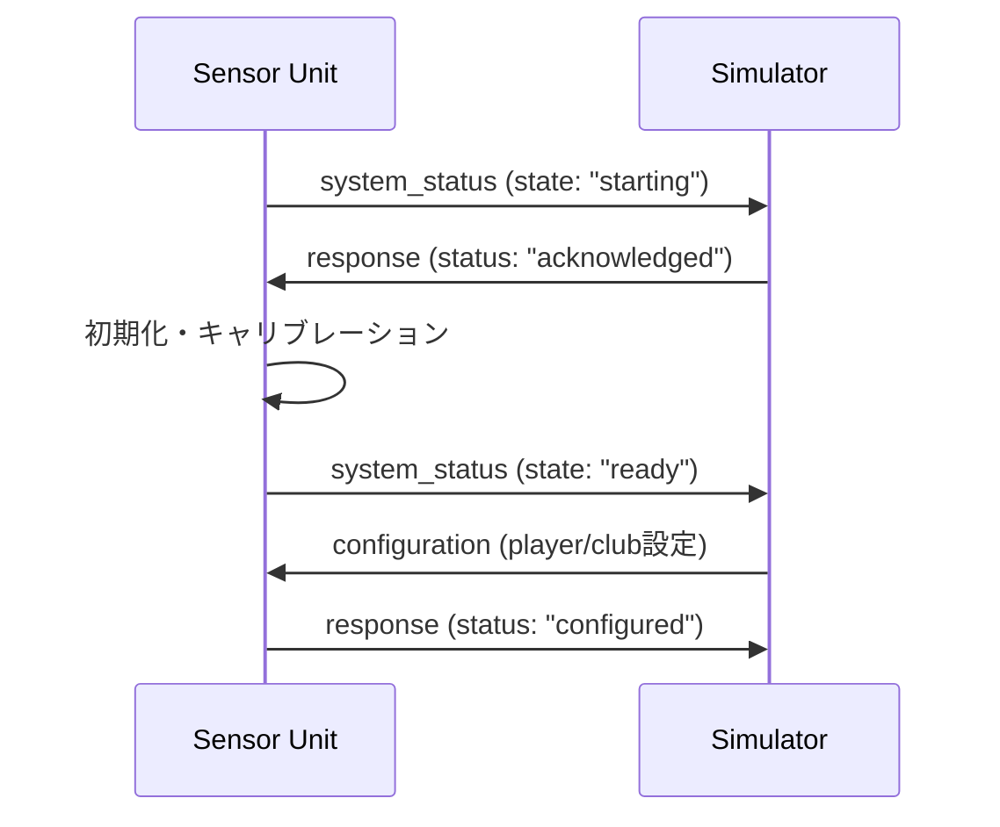
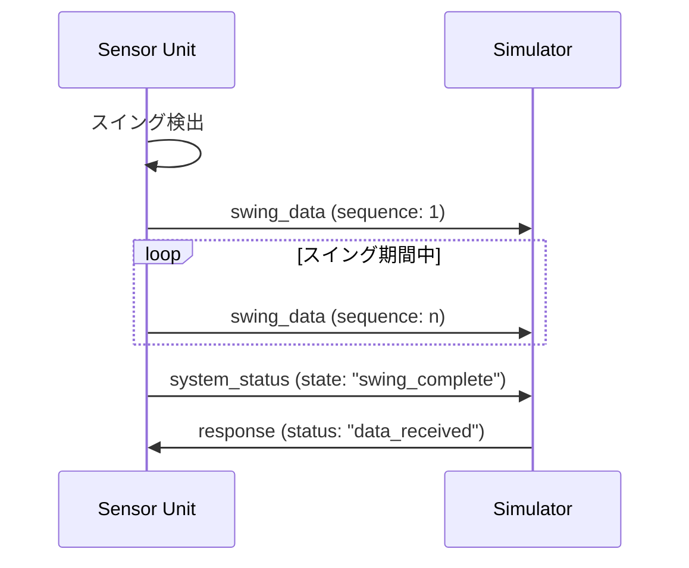

# Golf HILS System - API Specification

## 更新履歴
- v1.1 (2024-01-XX) - MQTTプロトコル追加
- v1.0 (2024-01-XX) - 初版作成

---

## 1. 概要

Golf HILSシステムでは、M5StickC Plus2（センサーユニット）とRaspberry Pi（シミュレーションユニット）間の通信に以下のプロトコルを使用します：

- **UART通信**: USB経由でのシリアル通信
- **MQTT通信**: Wi-Fi経由でのメッセージング

データ形式はJSON形式を標準とします。

---

## 2. UART通信プロトコル

### 2.1 接続設定
- **ボーレート**: 115200 bps
- **データビット**: 8
- **ストップビット**: 1
- **パリティ**: なし
- **フロー制御**: なし

### 2.2 データフレーム形式

#### 基本フレーム構造
```
{データペイロード}\n
```

- データペイロード: JSON形式
- 終端文字: 改行文字 (`\n`)

---

## 3. データ型定義

### 3.1 スイングデータ (SwingData)

```json
{
  "type": "swing_data",
  "timestamp": 1234567890123,
  "device_id": "M5StickCPlus2_001",
  "player": "Player1",
  "club": "7-Iron",
  "sensor_data": {
    "accel_x": 2.5,
    "accel_y": 1.2,
    "accel_z": 9.8,
    "gyro_x": 45.2,
    "gyro_y": 89.1,
    "gyro_z": 12.7
  },
  "metadata": {
    "battery_level": 85,
    "temperature": 25.3,
    "sequence": 1
  }
}
```

#### フィールド説明
| フィールド | 型 | 単位 | 説明 |
|-----------|-----|------|------|
| type | string | - | メッセージタイプ |
| timestamp | integer | ms | UNIX時刻（ミリ秒） |
| device_id | string | - | デバイス識別子 |
| player | string | - | プレイヤー名 |
| club | string | - | 使用クラブ名 |
| accel_x/y/z | float | G | 加速度 |
| gyro_x/y/z | float | dps | 角速度 |
| battery_level | integer | % | バッテリー残量 |
| temperature | float | °C | 温度 |
| sequence | integer | - | シーケンス番号 |

### 3.2 システム状態 (SystemStatus)

```json
{
  "type": "system_status",
  "timestamp": 1234567890123,
  "device_id": "M5StickCPlus2_001",
  "status": {
    "state": "ready",
    "battery_level": 85,
    "wifi_connected": true,
    "wifi_ssid": "GolfNet",
    "signal_strength": -45,
    "uptime": 3600
  }
}
```

### 3.3 設定データ (Configuration)

```json
{
  "type": "configuration",
  "timestamp": 1234567890123,
  "config": {
    "player_name": "Player1",
    "club_type": "7-Iron",
    "sensitivity": 2.0,
    "auto_detect": true,
    "recording_duration": 2000
  }
}
```

### 3.4 コマンド (Command)

```json
{
  "type": "command",
  "timestamp": 1234567890123,
  "command": "start_calibration",
  "parameters": {
    "duration": 10,
    "samples": 100
  }
}
```

### 3.5 応答 (Response)

```json
{
  "type": "response",
  "timestamp": 1234567890123,
  "response_to": "start_calibration",
  "status": "success",
  "data": {
    "calibration_complete": true,
    "offset_x": 0.02,
    "offset_y": -0.01,
    "offset_z": 0.98
  }
}
```

---

## 4. MQTT通信プロトコル

### 4.1 ブローカー設定
- **ポート**: 1883 (標準)
- **QoS**: 1 (最低1回配信保証)
- **Keep Alive**: 60秒
- **Clean Session**: true

### 4.2 トピック構造

#### 基本トピック構造
```
golf_hils/{device_id}/{message_type}
```

#### 具体例
- `golf_hils/M5StickCPlus2_001/swing_data`
- `golf_hils/M5StickCPlus2_001/status`
- `golf_hils/simulator/commands`
- `golf_hils/simulator/responses`

### 4.3 トピック一覧

| トピック | 方向 | 説明 |
|----------|------|------|
| `golf_hils/{device_id}/swing_data` | センサー→シミュレーター | スイングデータ |
| `golf_hils/{device_id}/status` | センサー→シミュレーター | システム状態 |
| `golf_hils/{device_id}/heartbeat` | センサー→シミュレーター | 生存確認 |
| `golf_hils/simulator/commands` | シミュレーター→センサー | コマンド |
| `golf_hils/simulator/responses` | シミュレーター→センサー | 応答 |
| `golf_hils/simulator/config` | シミュレーター→センサー | 設定 |

---

## 5. 通信シーケンス

### 5.1 システム起動シーケンス



### 5.2 スイング検出・データ送信シーケンス



---

## 6. エラーハンドリング

### 6.1 エラーコード

| コード | 説明 | 対処法 |
|--------|------|--------|
| E001 | JSON解析エラー | データ形式確認 |
| E002 | 必須フィールド不足 | データ項目確認 |
| E003 | 通信タイムアウト | 接続状態確認 |
| E004 | センサー初期化失敗 | ハードウェア確認 |
| E005 | バッテリー残量不足 | 充電実施 |

### 6.2 エラー応答形式

```json
{
  "type": "error",
  "timestamp": 1234567890123,
  "error_code": "E001",
  "error_message": "JSON parsing failed",
  "details": {
    "received_data": "invalid_json_data",
    "position": 15
  }
}
```

---

## 7. データ検証

### 7.1 データ範囲検証

| パラメータ | 最小値 | 最大値 | 単位 |
|------------|--------|--------|------|
| accel_x/y/z | -16.0 | 16.0 | G |
| gyro_x/y/z | -2000.0 | 2000.0 | dps |
| battery_level | 0 | 100 | % |
| temperature | -40 | 85 | °C |

### 7.2 タイムスタンプ検証
- 過去の値: 現在時刻から24時間以内
- 未来の値: 現在時刻から1分以内

---

## 8. セキュリティ

### 8.1 MQTT認証（オプション）
- **ユーザー名/パスワード**: 基本認証
- **TLS**: SSL/TLS暗号化（推奨）
- **証明書**: クライアント証明書認証

### 8.2 データ整合性
- **CRC**: チェックサム付加（オプション）
- **シーケンス番号**: データ欠損検出

---

## 9. パフォーマンス仕様

### 9.1 通信性能
- **UART通信**: 最大100Hz（10ms間隔）
- **MQTT通信**: 最大50Hz（20ms間隔）
- **レイテンシ**: 10ms以下

### 9.2 データサイズ
- **スイングデータ**: 約200バイト/パケット
- **システム状態**: 約150バイト/パケット
- **コマンド**: 約100バイト/パケット

---

## 10. 実装例

### 10.1 センサーユニット側（C++）

```cpp
// スイングデータ送信
void sendSwingData(SwingData data) {
    StaticJsonDocument<512> doc;
    doc["type"] = "swing_data";
    doc["timestamp"] = millis();
    doc["device_id"] = DEVICE_ID;
    doc["player"] = currentPlayer;
    doc["club"] = currentClub;
    
    JsonObject sensor = doc.createNestedObject("sensor_data");
    sensor["accel_x"] = data.accel_x;
    sensor["accel_y"] = data.accel_y;
    sensor["accel_z"] = data.accel_z;
    sensor["gyro_x"] = data.gyro_x;
    sensor["gyro_y"] = data.gyro_y;
    sensor["gyro_z"] = data.gyro_z;
    
    String output;
    serializeJson(doc, output);
    Serial.println(output);
}
```

### 10.2 シミュレーションユニット側（Python）

```python
# スイングデータ受信
def parse_swing_data(json_str):
    try:
        data = json.loads(json_str)
        if data.get('type') == 'swing_data':
            swing_data = SwingData(
                timestamp=data['timestamp'],
                player=data['player'],
                club=data['club'],
                accel_x=data['sensor_data']['accel_x'],
                accel_y=data['sensor_data']['accel_y'],
                accel_z=data['sensor_data']['accel_z'],
                gyro_x=data['sensor_data']['gyro_x'],
                gyro_y=data['sensor_data']['gyro_y'],
                gyro_z=data['sensor_data']['gyro_z']
            )
            return swing_data
    except (json.JSONDecodeError, KeyError) as e:
        logger.error(f"Failed to parse swing data: {e}")
    return None
```

---

## 11. テスト仕様

### 11.1 単体テスト
- JSON形式検証
- データ範囲検証
- エラーハンドリング

### 11.2 結合テスト
- UART通信テスト
- MQTT通信テスト
- 高負荷通信テスト

### 11.3 性能テスト
- スループット測定
- レイテンシ測定
- パケットロス率測定

---

> このAPI仕様書は開発の進展に応じて更新されます。最新版は本リポジトリで確認してください。