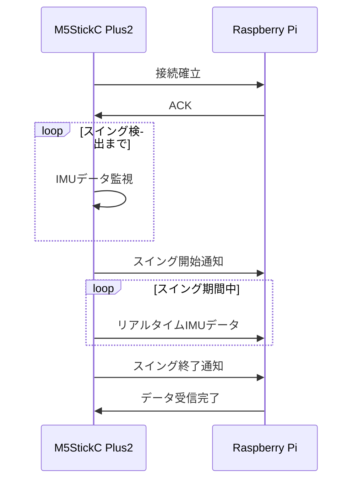

# Golf HILS System - Hardware Design Specification

## 更新履歴
- v1.0 (2024-01-XX) - 初版作成

---

## 1. システム全体ハードウェア構成

### 1.1 概要
Golf HILSシステムは以下の主要ハードウェアコンポーネントで構成されます：

- **センサーユニット**: M5StickC Plus2 (IMU内蔵)
- **シミュレーションユニット**: Raspberry Pi 4 Model B
- **ディスプレイ**: HDMI対応液晶ディスプレイ
- **通信**: USB-UART、Wi-Fi

### 1.2 システム構成図

```mermaid
graph TB
    subgraph "センサーユニット"
        M5[M5StickC Plus2]
        IMU[MPU6886 IMU]
        DISP[1.14" LCD]
        BTN[A/B/C ボタン]
        BATT[内蔵バッテリー]
        
        M5 --> IMU
        M5 --> DISP
        M5 --> BTN
        M5 --> BATT
    end
    
    subgraph "通信"
        UART[USB-UART]
        WIFI[Wi-Fi]
    end
    
    subgraph "シミュレーションユニット"
        RPI[Raspberry Pi 4B]
        SD[SDカード 32GB+]
        HDMI[HDMIディスプレイ]
        USB[USB電源]
    end
    
    M5 -.->|シリアル| UART
    M5 -.->|Wi-Fi| WIFI
    UART --> RPI
    WIFI --> RPI
    RPI --> HDMI
    RPI --> SD
    RPI --> USB
```

---

## 2. センサーユニット詳細仕様

### 2.1 M5StickC Plus2 仕様
- **MCU**: ESP32-PICO-D4
- **RAM**: 520KB SRAM
- **Flash**: 4MB
- **Wi-Fi**: 802.11 b/g/n
- **Bluetooth**: 4.2 BR/EDR + BLE
- **電源**: 内蔵200mAhバッテリー

### 2.2 IMU仕様 (MPU6886)
- **3軸加速度計**
  - 測定範囲: ±2/±4/±8/±16G
  - 分解能: 16bit
  - サンプリング周波数: 最大1kHz
  
- **3軸ジャイロスコープ**
  - 測定範囲: ±250/±500/±1000/±2000 dps
  - 分解能: 16bit
  - サンプリング周波数: 最大8kHz

### 2.3 ディスプレイ仕様
- **サイズ**: 1.14インチ TFT LCD
- **解像度**: 135×240ピクセル
- **色深度**: 16bit RGB565
- **視野角**: 全角

### 2.4 インターフェース
- **USB-C**: 充電・データ通信
- **Grove**: 拡張コネクタ
- **GPIO**: 拡張可能

### 2.5 物理仕様
- **寸法**: 48.2 × 25.5 × 13.7 mm
- **重量**: 約15g
- **動作温度**: -10°C ~ 50°C

---

## 3. シミュレーションユニット詳細仕様

### 3.1 Raspberry Pi 4 Model B 仕様
- **CPU**: Quad-core Cortex-A72 (ARM v8) 64-bit @ 1.5GHz
- **RAM**: 4GB LPDDR4-3200
- **GPU**: Broadcom VideoCore VI
- **ストレージ**: microSDカード (32GB以上推奨)

### 3.2 インターフェース
- **USB**: 2× USB 3.0, 2× USB 2.0
- **HDMI**: 2× micro HDMI (4K@60Hz対応)
- **GPIO**: 40-pin GPIO header
- **ネットワーク**: Gigabit Ethernet, Wi-Fi 802.11ac, Bluetooth 5.0

### 3.3 電源要件
- **入力電圧**: 5V DC
- **消費電流**: 最大3A
- **推奨電源**: 5V 3A USB-C電源アダプター

---

## 4. ディスプレイ要件

### 4.1 推奨ディスプレイ仕様
- **サイズ**: 7インチ以上
- **解像度**: 1024×768以上
- **接続**: HDMI
- **タッチ**: オプション（USB接続）

### 4.2 設置要件
- **視野角**: 練習エリアから確認可能
- **明るさ**: 屋外使用時は400cd/m²以上
- **応答速度**: 16ms以下

---

## 5. 通信システム設計

### 5.1 有線通信 (USB-UART)
- **接続**: M5StickC Plus2 ↔ Raspberry Pi
- **ケーブル**: USB-C to USB-A
- **通信速度**: 115200 bps
- **プロトコル**: シリアル通信
- **データ形式**: JSON over UART

### 5.2 無線通信 (Wi-Fi)
- **規格**: IEEE 802.11 b/g/n
- **周波数**: 2.4GHz帯
- **セキュリティ**: WPA2-PSK
- **プロトコル**: MQTT over TCP/IP
- **通信距離**: 屋内10m、屋外50m

### 5.3 通信シーケンス



---

## 6. 電源システム設計

### 6.1 センサーユニット電源
- **内蔵バッテリー**: 200mAh Li-Po
- **連続動作時間**: 約2-3時間
- **充電時間**: 約1時間
- **充電方法**: USB-C

### 6.2 シミュレーションユニット電源
- **AC電源**: 100-240V 50/60Hz
- **DC出力**: 5V 3A
- **消費電力**: 最大15W
- **UPS**: オプション（停電対策）

---

## 7. 機械的設計

### 7.1 センサー取付
- **取付位置**: ゴルフクラブシャフト
- **取付方法**: 面ファスナー式バンド
- **取付角度**: シャフト軸と平行
- **固定強度**: スイング時の遠心力に対応

### 7.2 システム配置
- **シミュレーションユニット**: 屋内設置
- **ディスプレイ**: 打席から視認可能位置
- **ケーブル配線**: 安全性を考慮したレイアウト

---

## 8. 環境条件

### 8.1 動作環境
- **温度**: 0°C ~ 40°C
- **湿度**: 20% ~ 80% RH (結露なし)
- **振動**: 車載レベル
- **防水**: IPX4相当（センサーユニット）

### 8.2 保管環境
- **温度**: -10°C ~ 60°C
- **湿度**: 10% ~ 90% RH (結露なし)

---

## 9. 安全設計

### 9.1 電気的安全
- **過電圧保護**: 各ユニットに内蔵
- **過電流保護**: ヒューズ・回路ブレーカー
- **絶縁**: クラス2相当

### 9.2 機械的安全
- **衝撃保護**: 筐体設計
- **落下防止**: 取付バンド安全係数2以上
- **鋭利部なし**: 怪我防止設計

---

## 10. 拡張性

### 10.1 センサー拡張
- **追加IMU**: Grove接続
- **GPS**: 位置情報取得
- **環境センサー**: 温度・湿度・気圧

### 10.2 出力拡張
- **音声出力**: スピーカー追加
- **LEDインジケーター**: 状態表示
- **バイブレーション**: 触覚フィードバック

---

## 11. 保守・メンテナンス

### 11.1 定期点検項目
- **バッテリー容量**: 月1回
- **通信状態**: 週1回
- **取付状態**: 使用前毎回
- **ソフトウェア更新**: 随時

### 11.2 消耗品交換
- **バッテリー**: 1-2年毎
- **取付バンド**: 半年毎
- **SDカード**: 2-3年毎

---

## 12. 技術仕様一覧

| 項目 | 仕様 |
|------|------|
| センサー | M5StickC Plus2 + MPU6886 |
| 処理装置 | Raspberry Pi 4 Model B |
| 通信方式 | USB-UART + Wi-Fi |
| 電源 | 内蔵バッテリー + AC電源 |
| ディスプレイ | HDMI液晶 |
| 動作温度 | 0°C ~ 40°C |
| 防水等級 | IPX4 |
| 重量 | センサー部: 15g |

---

> このドキュメントは随時更新されます。最新版は本リポジトリで確認してください。