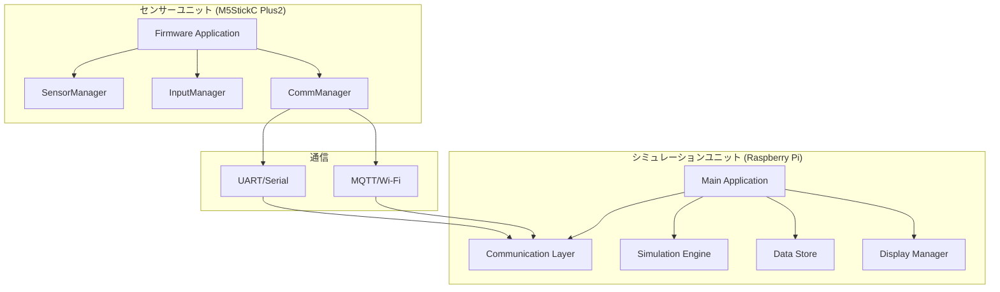
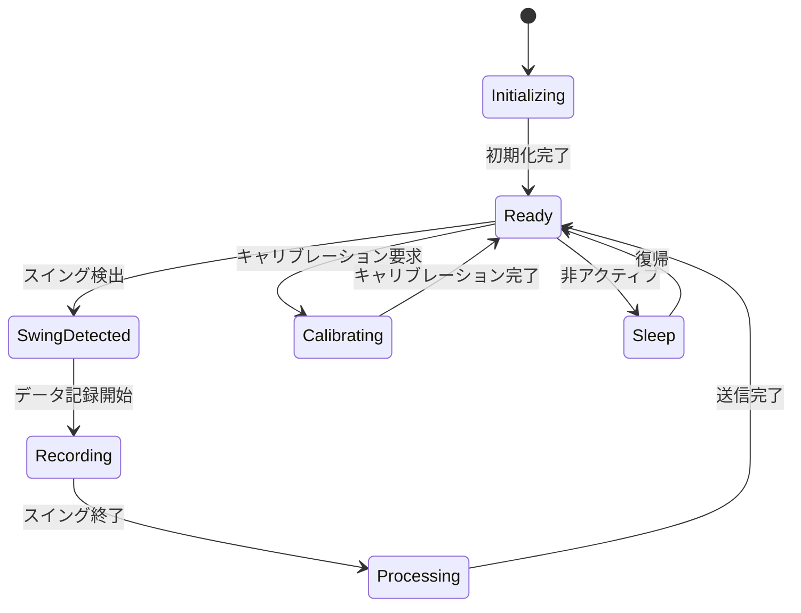
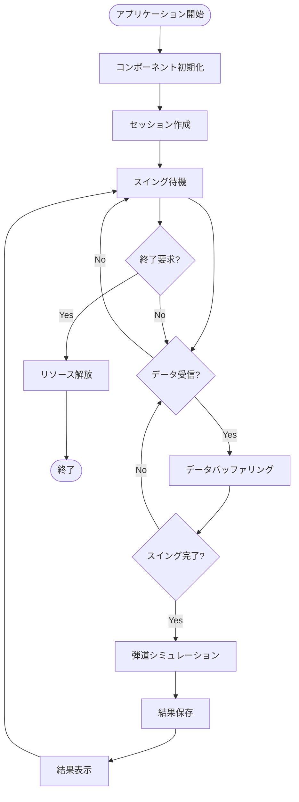
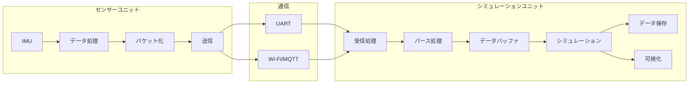
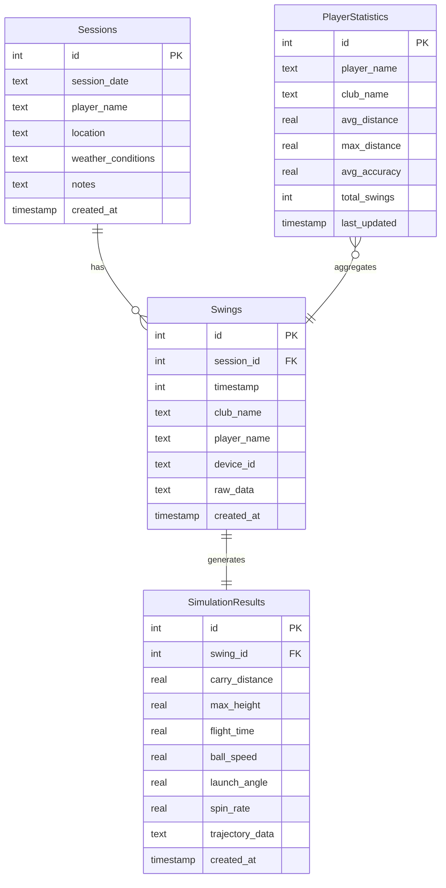

# Golf HILS System - Software Architecture

## 更新履歴
- v1.0 (2024-01-XX) - 初版作成

---

## 1. システムソフトウェア全体構成

### 1.1 アーキテクチャ概要

Golf HILSシステムは以下のソフトウェアコンポーネントで構成されています：



### 1.2 技術スタック

#### センサーユニット
- **言語**: C++
- **フレームワーク**: Arduino Core for ESP32
- **ライブラリ**: M5StickCPlus2, ArduinoJson, PubSubClient
- **IDE**: PlatformIO, Arduino IDE

#### シミュレーションユニット
- **言語**: Python 3.9+
- **フレームワーク**: NumPy, SciPy, Matplotlib
- **ライブラリ**: pygame, pyserial, paho-mqtt
- **データベース**: SQLite3
- **OS**: Raspberry Pi OS (Debian)

---

## 2. センサーユニットソフトウェア設計

### 2.1 モジュール構成

```
sensor-firmware/
├── src/
│   ├── main.cpp                    # メインアプリケーション
│   ├── SensorManager/              # IMU制御モジュール
│   │   ├── imu_data_acquisition.h/.cpp
│   │   └── sensor_calibration.h/.cpp
│   ├── InputManager/               # 入力制御モジュール
│   │   ├── golf_club_selector.h/.cpp
│   │   └── button_handler.h/.cpp
│   └── CommManager/                # 通信制御モジュール
│       ├── swing_data_transmitter.h/.cpp
│       └── protocol_handler.h/.cpp
├── lib/                            # 外部ライブラリ
└── examples/                       # 使用例
```

### 2.2 主要クラス設計

#### IMUDataAcquisition クラス
```cpp
class IMUDataAcquisition {
private:
    float accel_offset_x, accel_offset_y, accel_offset_z;
    float gyro_offset_x, gyro_offset_y, gyro_offset_z;
    
public:
    bool initialize();
    void calibrateIMU();
    SwingData readSwingData();
    bool detectSwingStart(const SwingData& data);
};
```

#### GolfClubSelector クラス
```cpp
class GolfClubSelector {
private:
    int current_club_index;
    int current_player_index;
    
public:
    bool initialize();
    void update();
    ClubType getCurrentClub();
    String getCurrentClubName();
    String getCurrentPlayerName();
};
```

#### SwingDataTransmitter クラス
```cpp
class SwingDataTransmitter {
private:
    bool is_serial_initialized;
    bool is_wifi_connected;
    
public:
    bool initializeSerial(unsigned long baud = 115200);
    bool initializeWiFi(const char* ssid, const char* password);
    bool sendSwingData(const SwingData& data, TransmissionMode mode);
    void maintainConnections();
};
```

### 2.3 状態管理



---

## 3. シミュレーションユニットソフトウェア設計

### 3.1 モジュール構成

```
simulator-py/
├── main.py                         # メインアプリケーション
├── comm/                           # 通信モジュール
│   ├── serial_data_listener.py
│   └── mqtt_client.py
├── sim/                            # シミュレーションモジュール
│   ├── ball_flight_simulator.py
│   └── physics_engine.py
├── data/                           # データ管理モジュール
│   ├── golf_data_store.py
│   └── session_manager.py
├── disp/                           # 表示モジュール
│   ├── trajectory_display.py
│   └── statistics_viewer.py
├── config/                         # 設定ファイル
└── examples/                       # 使用例
```

### 3.2 主要クラス設計

#### SerialDataListener クラス
```python
class SerialDataListener:
    def __init__(self, port: str, baud_rate: int):
        self.port = port
        self.baud_rate = baud_rate
        self.data_callback = None
    
    def connect(self) -> bool:
    def disconnect(self):
    def set_data_callback(self, callback):
    def parse_swing_data(self, json_str: str) -> Optional[SwingData]:
    def listen_for_data(self) -> None:
```

#### GolfBallSimulator クラス
```python
class GolfBallSimulator:
    def __init__(self):
        self.GRAVITY = 9.81
        self.AIR_DENSITY = 1.225
        self.club_specs = {...}
    
    def analyze_swing_data(self, swing_data_points: List) -> Dict[str, float]:
    def calculate_initial_conditions(self, swing_analysis: Dict) -> LaunchConditions:
    def simulate_trajectory(self, launch_conditions: LaunchConditions) -> List[TrajectoryPoint]:
    def simulate_complete_shot(self, swing_data: List, club: str) -> Dict[str, Any]:
```

#### GolfDataStore クラス
```python
class GolfDataStore:
    def __init__(self, db_path: str):
        self.db_path = db_path
        self.connection = None
    
    def create_session(self, player_name: str) -> int:
    def store_swing_data(self, session_id: int, swing_data: Dict) -> int:
    def store_simulation_result(self, swing_id: int, result: Dict) -> int:
    def get_player_statistics(self, player_name: str) -> List[Dict]:
    def export_to_csv(self, output_dir: str) -> str:
```

### 3.3 アプリケーション制御フロー



---

## 4. データフロー設計

### 4.1 リアルタイムデータフロー



### 4.2 データベース設計



---

## 5. 通信アーキテクチャ

### 5.1 プロトコルスタック

```
┌─────────────────────────────────────┐
│        Application Layer            │
│     (JSON Data Exchange)            │
├─────────────────────────────────────┤
│       Presentation Layer            │
│    (Data Serialization)             │
├─────────────────────────────────────┤
│        Session Layer                │
│   (Connection Management)           │
├─────────────────────────────────────┤
│       Transport Layer               │
│    (UART / TCP/MQTT)                │
├─────────────────────────────────────┤
│        Network Layer                │
│      (IP / None)                    │
├─────────────────────────────────────┤
│       Data Link Layer               │
│    (Wi-Fi / USB)                    │
├─────────────────────────────────────┤
│       Physical Layer                │
│  (Radio / USB Cable)                │
└─────────────────────────────────────┘
```

### 5.2 メッセージキューイング

```python
# メッセージ処理アーキテクチャ
class MessageProcessor:
    def __init__(self):
        self.message_queue = Queue()
        self.handlers = {
            'swing_data': self.handle_swing_data,
            'system_status': self.handle_system_status,
            'command': self.handle_command
        }
    
    def process_messages(self):
        while not self.message_queue.empty():
            message = self.message_queue.get()
            handler = self.handlers.get(message['type'])
            if handler:
                handler(message)
```

---

## 6. エラー処理・例外設計

### 6.1 エラー階層

```
SystemError
├── HardwareError
│   ├── SensorError
│   └── CommunicationError
├── SoftwareError
│   ├── ConfigurationError
│   ├── DataValidationError
│   └── SimulationError
└── UserError
    ├── InvalidInputError
    └── OperationError
```

### 6.2 エラー処理戦略

```python
class ErrorHandler:
    @staticmethod
    def handle_error(error: Exception, context: str):
        if isinstance(error, HardwareError):
            return ErrorHandler.handle_hardware_error(error, context)
        elif isinstance(error, SoftwareError):
            return ErrorHandler.handle_software_error(error, context)
        else:
            return ErrorHandler.handle_unknown_error(error, context)
    
    @staticmethod
    def handle_hardware_error(error: HardwareError, context: str):
        # ハードウェアエラーの復旧処理
        logger.error(f"Hardware error in {context}: {error}")
        # 再初期化試行
        # フェイルセーフモード移行
```

---

## 7. パフォーマンス設計

### 7.1 リアルタイム要件
- **データ取得頻度**: 100Hz (10ms間隔)
- **通信レイテンシ**: 10ms以下
- **シミュレーション応答**: 1秒以内
- **表示更新**: 60fps

### 7.2 メモリ使用量
- **センサーユニット**: 最大512KB RAM
- **シミュレーションユニット**: 最大1GB RAM
- **データバッファ**: 最大10MB

### 7.3 最適化手法

#### センサーユニット
```cpp
// 効率的なデータ構造
struct __attribute__((packed)) SwingDataCompact {
    uint32_t timestamp;
    int16_t accel_x, accel_y, accel_z;    // 0.01G単位
    int16_t gyro_x, gyro_y, gyro_z;       // 0.1dps単位
};
```

#### シミュレーションユニット
```python
# NumPyを使用した高速計算
import numpy as np

def calculate_trajectory_vectorized(initial_conditions):
    # ベクトル化された物理計算
    t = np.linspace(0, flight_time, num_points)
    x = v0x * t + 0.5 * ax * t**2
    y = v0y * t + 0.5 * ay * t**2
    return x, y
```

---

## 8. セキュリティ設計

### 8.1 セキュリティ要件
- **データ整合性**: チェックサム検証
- **通信暗号化**: TLS/SSL (オプション)
- **アクセス制御**: デバイス認証
- **データ保護**: ローカルストレージ暗号化

### 8.2 実装例

```python
# データ整合性検証
import hashlib

def verify_data_integrity(data: bytes, checksum: str) -> bool:
    calculated_checksum = hashlib.sha256(data).hexdigest()
    return calculated_checksum == checksum

# セキュアな設定管理
class SecureConfig:
    @staticmethod
    def encrypt_config(config: dict, key: bytes) -> bytes:
        # 設定データの暗号化
        pass
    
    @staticmethod
    def decrypt_config(encrypted_data: bytes, key: bytes) -> dict:
        # 設定データの復号化
        pass
```

---

## 9. テスト設計

### 9.1 テスト階層

```
テスト階層
├── 単体テスト (Unit Tests)
│   ├── センサーモジュールテスト
│   ├── シミュレーションエンジンテスト
│   └── データストアテスト
├── 結合テスト (Integration Tests)
│   ├── 通信プロトコルテスト
│   └── システム連携テスト
├── システムテスト (System Tests)
│   ├── エンドツーエンドテスト
│   └── パフォーマンステスト
└── 受け入れテスト (Acceptance Tests)
    ├── ユーザーシナリオテスト
    └── 要件適合性テスト
```

### 9.2 テスト自動化

```python
# 自動テストフレームワーク
import pytest

class TestGolfSimulator:
    @pytest.fixture
    def simulator(self):
        return GolfBallSimulator()
    
    @pytest.fixture
    def sample_swing_data(self):
        return [MockSwingData(...) for _ in range(10)]
    
    def test_swing_analysis(self, simulator, sample_swing_data):
        result = simulator.analyze_swing_data(sample_swing_data)
        assert result['club_head_speed'] > 0
        assert result['impact_force'] > 0
    
    def test_trajectory_calculation(self, simulator):
        launch_conditions = LaunchConditions(...)
        trajectory = simulator.simulate_trajectory(launch_conditions)
        assert len(trajectory) > 0
        assert trajectory[-1].y >= 0  # ボールが地面に着地
```

---

## 10. 保守・運用設計

### 10.1 ログ設計

```python
# 構造化ログ
import logging
import json

class StructuredLogger:
    def __init__(self, name: str):
        self.logger = logging.getLogger(name)
    
    def log_swing_event(self, player: str, club: str, distance: float):
        log_data = {
            'event_type': 'swing_completed',
            'player': player,
            'club': club,
            'distance': distance,
            'timestamp': time.time()
        }
        self.logger.info(json.dumps(log_data))
```

### 10.2 監視・診断

```python
# システム監視
class SystemMonitor:
    def __init__(self):
        self.metrics = {}
    
    def collect_metrics(self):
        self.metrics.update({
            'cpu_usage': psutil.cpu_percent(),
            'memory_usage': psutil.virtual_memory().percent,
            'disk_usage': psutil.disk_usage('/').percent,
            'active_connections': len(self.active_connections),
            'message_queue_size': self.message_queue.qsize()
        })
    
    def check_health(self) -> bool:
        return (self.metrics['cpu_usage'] < 80 and 
                self.metrics['memory_usage'] < 90)
```

---

## 11. 拡張性設計

### 11.1 プラグインアーキテクチャ

```python
# プラグインインターフェース
class SimulationPlugin:
    def initialize(self, config: dict):
        pass
    
    def process_swing_data(self, data: SwingData) -> SimulationResult:
        pass
    
    def cleanup(self):
        pass

# プラグインローダー
class PluginManager:
    def __init__(self):
        self.plugins = {}
    
    def load_plugin(self, plugin_name: str, plugin_class: type):
        self.plugins[plugin_name] = plugin_class()
    
    def execute_plugin(self, plugin_name: str, data: SwingData):
        return self.plugins[plugin_name].process_swing_data(data)
```

### 11.2 API拡張

```python
# RESTful API (将来拡張)
from flask import Flask, jsonify, request

app = Flask(__name__)

@app.route('/api/v1/swings', methods=['POST'])
def create_swing():
    swing_data = request.json
    result = simulator.process_swing(swing_data)
    return jsonify(result)

@app.route('/api/v1/players/<player_id>/statistics', methods=['GET'])
def get_player_stats(player_id):
    stats = data_store.get_player_statistics(player_id)
    return jsonify(stats)
```

---

> このソフトウェア設計書は開発の進展に応じて継続的に更新されます。最新版は本リポジトリで確認してください。